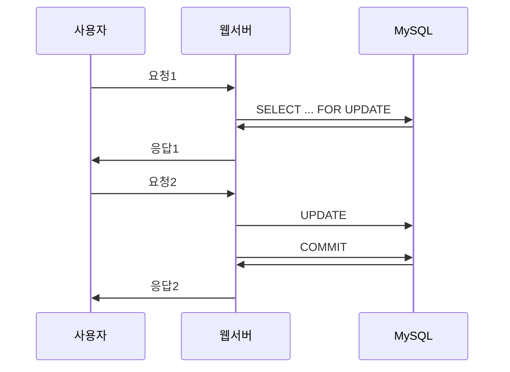

# 12. 쿼리 종류별 lock
## 목차
* InnodDB의 기본 lock 방식
* SQL 문장별로 사용하는 lock
* InnoDB에서 deadlock 만들기

## 시작하기
* MySQL은 여러가지 스토리지 엔진을 사용할 수 있다.
* 각각의 스토리지 엔진이 모두 서로 각자의 잠금과 트랜잭션 기능을 지원하고 있다.
* 그래서 MySQL에서는 Lock과 관련된 문제를 다루기가 조금 까다롭다.

## 목적
* Lock에 대한 이해를 통해 Lock wait을 조금이라도 줄이고 빠른 속도로 처리되도록 쿼리를 개선하자.
* SQL 문장별로 어떤 잠금이 사용되는지, 어떻게 우회할 수 있는지 살펴보자.

# 12.1 InnoDB의 기본 잠금 방식
* InnoDB에서는 각 쿼리의 패턴별로 사용하는 lock이 다르다.
* 평소에 lock을 사용하지 않는 쿼리가 어떠한 기능이 추가되면서 lock을 사용하게 되는 등 복잡한 부분이 있어서 주의해야 한다.

## SELECT
* REPEATABLE-READ 이하 transaction isolation level에서는 Lock을 사용하지 않는다.
* 이미 lock 상태의 record를 읽는 것도 제약이 없다.
* SERIALIABLE isolation level에서는 모든 SELECT 쿼리에 LOCK IN SHARE MODE가 덧붙여진다. (read lock을 걸고 실행됨, 성능 저하 발생.)

### SELECT로 읽은 record에 lock을 거는 방법
* read-mode
	```sql
	SELECT * FROM employees WHERE emp_no = 10001 LOCK IN SHARE MODE;
	```
* write-mode
	```sql
	SELECT * FROM employees WHERE emp_no = 10001 FOR UPDATE;
	```

- 위 두가지 방식 모두 다른 트랜잭션에서 변경하지 못하게 막는다.
- read-mode는 읽기에 대해서만 lock을 획득한 상태라서, 해당 레코드를 변경하려면 다시 write-lock을 획득해야 한다.
	- deadlock을 유발하는 가장 일반적인 형태.
	- 읽은 뒤 변경해야 한다면 처음부터 FOR UPDATE를 사용하자.
	- write-lock은 다른 트랜잭션에 대한 영향도가 크기 때문에, 반드시 읽고 나서 변경이 필요할 때만 사용하자.
- 위의 lock 방식들은 commit, rollback이 실행되면 잠금이 해제된다. 반드시 한 트랜잭션 내에서만 유효하다는 점을 기억하라.
- 아래와 같은 경우에는 사용할 수 없다.
	- 요청1에서 read or write lock을 사용하고 그냥 종료해버리면 해당 커넥션은 다시 사용할 수 없게 됨.
	- 요청2를 수행하지 않고 사용자가 떠나버리면, 요청1에서 잠긴 레코드는 영원히 잠금이 해제되지 않는다.

* try finally로 반드시 commit, rollback이 수행되어 트랜잭션이 종료되도록 작성해야 한다.

## INSERT, UPDATE, DELETE

* 기본적으로 write-lock을 사용한다. 필요 시 read-lock을 사용할수도 있다.
* connection에 auto-commit이 활성화되어 있어도 SQL 처리 시 lock을 획득하고 해제하는 작업은 수행된다.
	* 각 SQL 문장마다 트랜잭션이 자동으로 시작되고 종료된다고 이해하자.
* auto-commit이 설정되지 않으면 SQL이 실행될 때 자동으로 트랜잭션이 시작되지만, 종료는 반드시 COMMIT, ROLLBACK 명령을 사용해서 수동으로 종료시켜야 한다.

### UPDATE, DELETE lock의 잠금
* 쿼리가 실행될 때 조건 절에 일치하는 레코드를 찾기 위해, 스캔하는 인덱스의 모든 레코드에 잠금을 건다.
	* where절 조건에 일치하지 않는 레코드도 lock 대상이 된다.
	* 조건 절에 조건을 모두 사용하지 않을 수 있다. (10개 조건을 지정했을 때 일부 조건만 사용)
	* MySQL은 인덱스를 적절히 사용할 수 있는 조건만 있으면 스토리지 엔진으로 전달한다.
	* InnoDB 스토리지 엔진은 WHERE절에 명시된 모든 조건에 일치하는 레코드만 선별적으로 lock을 거는 것이 불가능하다. 그래서 index를 사용할 수 있는 조건만 일치하면 모두 잠궈버린다.

```sql
-- index는 first_name만 존재한다.
UPDATE employees SET last_name = '...'
WHERE first_name='Gerogi' AND ' gender='F';
```
- 스토리지 엔진에서 `first_name='Gerogi'`인 모든 레코드를 lock 건다. (불필요하게!)
- MySQL 엔진에서 성별이 F인 사원의 last_name만 변경한다.
- UPDATE, DELETE 쿼리가 실행될 때는 항상 lock 대상이 변경 대상 레코드보다 범위가 크거나 같다.

### 정리
- select에서는 사용하지 않더라도 update, delete를 위해서 반드시 인덱스를 만들어야 할 때가 있다.
	- 제대로 된 인덱스를 사용하지 못하면, 쿼리가 상당히 비효율적으로 실행되며 동시성도 떨어진다.
- update, delete의 조건으로 사용되는 컬럼이 있다면 반드시 해당 컬럼에 인덱스를 생성하기를 권장한다.
	- 조건절 컬럼이 인덱스가 없으면, 대체할 인덱스가 없을 경우 모든 레코드에 lock을 걸고 변경 대상 레코드를 찾아서 변경한다. (MyISAM 보다도 동시성이 떨어질 수 있다)
- 바이너리 로그 기록 안할 경우,
	- REPETABLE-READ 가 아니라 READ-COMMITTED로 사용할 수 있다.
	- 이때는 인덱스와 관계없이 실제 변경되는 레코드만 lock을 걸게 된다.
		- 정확히는, 인덱스 조건에 일치하는 모든 레코드에 lock을 걸었다가, 실제 변경 대상을 모두 찾아서 조건이 일치하지 않는 대상은 lock을 해제한다.
		- SELECT의 read-lock, write-lock도 동일하다.

# 12.2 SQL 문장별로 사용하는 lock
* 쿼리 종류별로 사용하는 lock 방식이 다르다.
* 전혀 lock을 사용하지 않을 것으로 예상했던 쿼리도 lock을 사용하는 것이 있다.

## 1. SELECT 쿼리의 lock
### 1) SELECT ... FROM ...
* 기본 형태의 select 쿼리는 lock을 사용하지 않는다.
* 만약 읽어야 할 레코드가 다른 트랜잭션에 의해 변경되거나 삭제되는 중이라면 undo log를 이용해 레코드를 읽는다.
* select만 수행할 때는 다른 트랜잭션 쿼리의 영향을 받지 않으며, 대기하지도 않는다.
* DDL 문장으로 테이블 구조가 변경되는 중에도 처리될 수 있다.
* 단, SERIALIZABLE 인 경우 `LOCK IN SHARE MODE`가 기본으로 붙는다.

### 2) SELECT ... FROM ... LOCK IN SHARE MODE
* WHERE절에 일치하는 레코드 뿐 아니라 검색을 위해 접근한 모든 레코드에 대해 `Shared next-key lock`을 사용한다.
* 만약 해당 레코드가 다른 트랜잭션에 의해 write-lock이 걸려있다면 잠금이 해제될 때까지 wait 한다.
* 만약 해당 레코드가 다른 트랜잭션에 의해 read-lock이 걸려있다면 별도의 대기 없이 lock을 획득한다.
* 해당 lock은 COMMIT, ROLLBACK 명령으로 트랜잭션이 종료되면 자동으로 해제된다.
* DDL 문장은 실행이 완료되면 자동으로 트랜잭션을 종료시키므로, 같은 트랜잭션에서 DDL이 실행되면 자동으로 lock이 해제된다.

### 3) SELECT ... FROM ... FOR UPDATE
* WHERE 절에 일치하는 레코드 뿐 아니라 검색을 위해 접근한 모든 레코드에 대해서 `Exclusive next-key lock`을 사용한다.
* 대상 레코드가 다른 트랜잭션에 의해 read-lock, write-lock으로 잠겨있다면 해제될때까지 wait 한다.
* `FOR UPDATE`가 사용되면 select 쿼리는 snapshot을 이용한 읽기를 사용하지 못하기 때문에 `consistent read`가 무시된다. (page 127 non-locking consistent read 참고)

## 2. INSERT 쿼리의 lock
### 1) INSERT ...
* 기본적으로 `exclusive-record-lock`을 사용한다.
* primary key, unique key가 존재하면 중복 체크를 위해 `shared-record-lock`을 먼저 획득해야 한다.
* 추가로 `insert intention lock` 방식도 사용한다.
	* INSERT를 실행할 의도를 지닌 쿼리가 획득해야 하는 lock
	* 모든 INSERT 쿼리는 이 lock을 획득한 후에 insert를 수행한다.
	* insert된 레코드에 대해서는 `exclusive-record-lock`을 자동으로 획득하게 된다.
	* GAB-LOCK의 일종.
	* 여러 트랜잭션이 동시에 `insert-intention-lock`을 획득할 수 있다.
	* 그러나 다른 트랜잭션이 이미 record-lock, gab-lock을 걸고 있다면 `insert-intention-lock`을 획득하기 위해 wait 해야 한다.
	* InnoDB의 Intention-lock과 다르니 유의하자. 이건 MyISAM의 table-lock과 호환을 위해 존재하는 lock이다.

#### insert intention lock
* GAB-Lock으로 인한 동시성 감소를 최소화하기 위해 사용된다.
```sql
CREATE TABLE tb_test {
  fdpk INT NOT NULL,
  PRIMARY KEY(fdpk)
);
INSERT INTO tb_test VALUES (1), (6), (8), (9);
```
위 상태에서 3개의 INSRET 쿼리를 실행할 때 lock 사용현황을 살펴보자.
```sql
-- transaction#1
BEGIN;
INSERT INTO tb_test VALEUS (5);

-- transaction#2
BEGIN;
INSERT INTO tb_test VALEUS (3);

-- transaction#3
BEGIN;
INSERT INTO tb_test VALEUS (4);
```
* 만약 `insert-intention-lock`이 없다면?
	* InnoDB는 1~6 사이의 새로운 primary key를 insert하기 위해 해당 구간에 lock을 잡아야 함.
	* exclusive-gab-lock을 사용할 것이다.
	* 그러면 위의 3개 트랜잭션은 모두 동일한 구간에 gab-lock을 잡기 위해 순차적으로 실행된다.
		* fdpk 값이 1~6 레코드 간격을 exclusive-gab-lock으로 잠근다.
		* 새로운 primary key 값을 insert한다.
		* 새로 insert된 primary key 


### 2) INSERT INTO ... ON DUPLICATE KEY UPDATE ...

### 3) REPLACE ...


### 4) INSERT INTO tb_new ... SELECT ... FROM tb_old ...

### 5) REPLACE INTO tb_new ... SELECT ... FROM tb_old ...
* `INSERT INTO tb_new ... SELECT ... FROM tb_old ...` 과 마찬가지로, tb_old 테이블은 shared-lock을 걸고 tb_new 테이블은 exclusive-lock을 건다.
* tb_old 테이블에 lock을 회피하는 방법은 위와 동일하다.
	* 두 개 쿼리로 나눠서 실행하는 3번째 방법은 `LOAD DATA INFILE ...` 명령에 `REPLACE` 옵션을 사용해야 동일한 효과를 낼 수 있다.

## 3. UPDATE 쿼리의 lock

### 1) UPDATE ... WHERE ...

### 2) UPDATE tb_test1 a, tb_test2 b ON ... SET a.column = b.column ...

## 4. DELETE 쿼리의 lock

### 1) DELETE FROM ... WHERE ...
### 2) DELETE a FROM tb_test1 a, tb_test2 b ...

## 5. DDL 문장의 lock
### 1) CREATE TABLE tb_new ... SELECT ... FROM tb_old ...

### 2) RENAME TABLE tb_test TO tb_Backup, tb_swap TO tb_test, ...


## InnoDB에서 여러 쿼리 패턴 간의 lock wait


# 12.3 InnoDB에서 deadlock 만들기

## 패턴1 (상호 거래 관련)

## 패턴2 (유니크 인덱스 관련)

## 패턴3 (외래키 관련)

## 패턴4 (서로 다른 인덱스를 통한 잠금)


<!--stackedit_data:
eyJoaXN0b3J5IjpbLTg5MjkyOTI1NywtMTk1NTMwNjExNiwxMz
I3MzUxMTM3LDE3MzQ5MjI0MzVdfQ==
-->